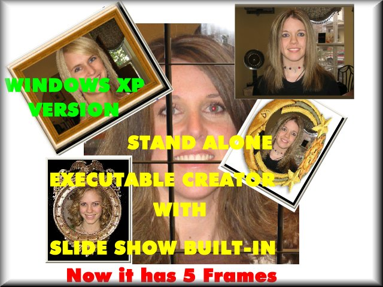



## Stand Alone Images \- Executable Creator XP  Version 2

### Description

Pack a lot of Images into a STANDALONE EXECUTABLE file and see the Slide Show with Fade Transition and Full Screen features.

Add New features: STATIC FRAME and REAL TIME resize.Update missing Main code.

Requires Windows XP
 
### More Info
 
Pack a lot of Images into a STANDALONE EXECUTABLE file and see the Slide

Show with Fade Transition and Full Screen features.

JPEG images are advisable.

The Slide Show program is built-in as Resource into the Main program, if you want

make any modification compile it and create a new CUSTTOM resource using the

new executable file.

In this version for Windows XP, the Fade is compatible with ON-BOARD Video

Cards and you can change the Fade Parameters.

Using the Slide Show

- Press ESC key to EXIT

- Press CTRL to Preferences Window

- Double Click to Screen Mode Resizable/Full Screen

- Press F1 ... F5 to change the Static Frame

             |
---                |---
**Submitted On**   |2007-01-24 04:45:16
**By**             |[Agustin Rodriguez](https://github.com/Planet-Source-Code/PSCIndex/blob/master/ByAuthor/agustin-rodriguez.md)
**Level**          |Intermediate
**User Rating**    |5.0 (60 globes from 12 users)
**Compatibility**  |VB 6\.0
**Category**       |[Graphics](https://github.com/Planet-Source-Code/PSCIndex/blob/master/ByCategory/graphics__1-46.md)
**World**          |[Visual Basic](https://github.com/Planet-Source-Code/PSCIndex/blob/master/ByWorld/visual-basic.md)
**Archive File**   |[Stand\_Alon205272392007\.zip](https://github.com/Planet-Source-Code/agustin-rodriguez-stand-alone-images-executable-creator-xp-version-2__1-67630/archive/master.zip)

